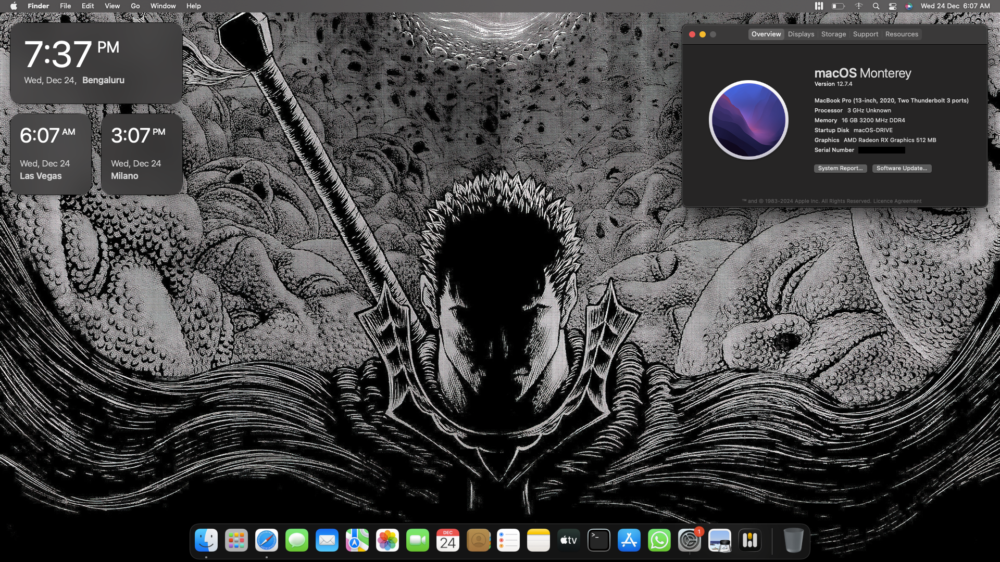
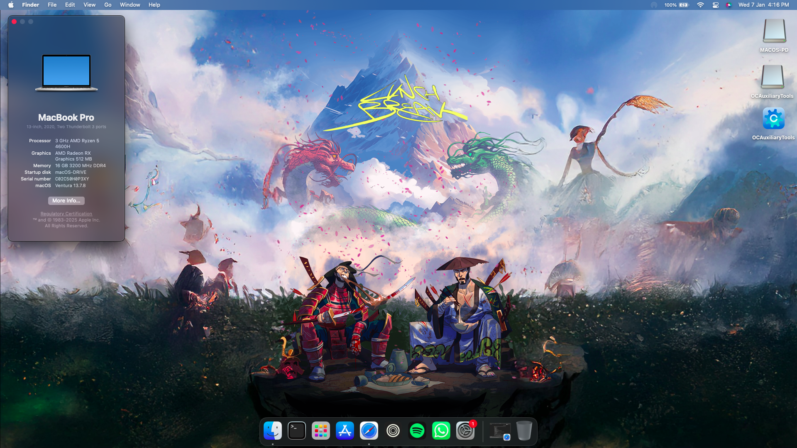
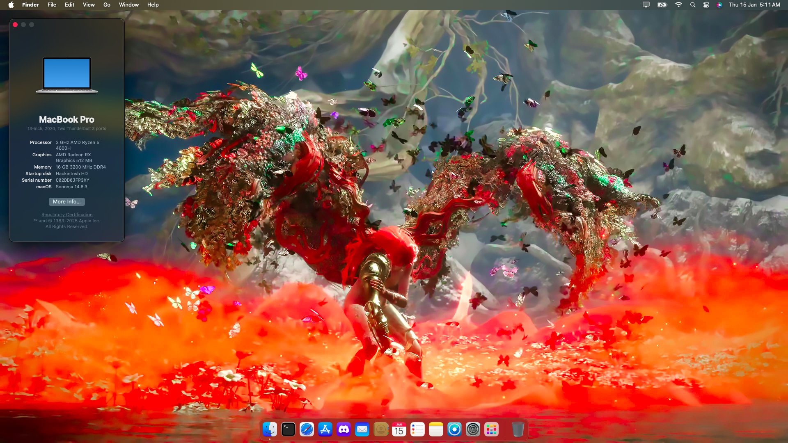
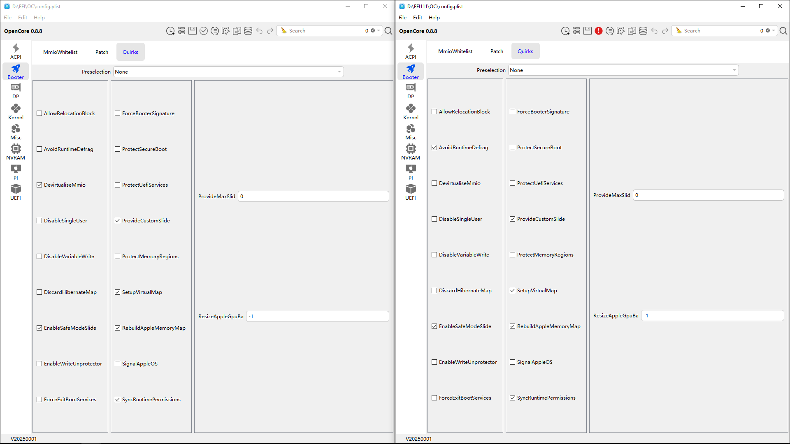
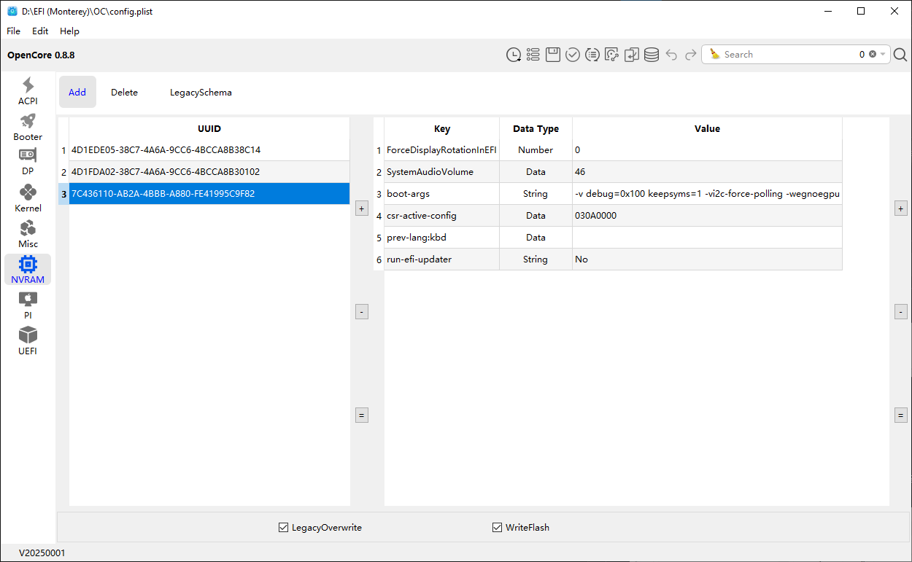
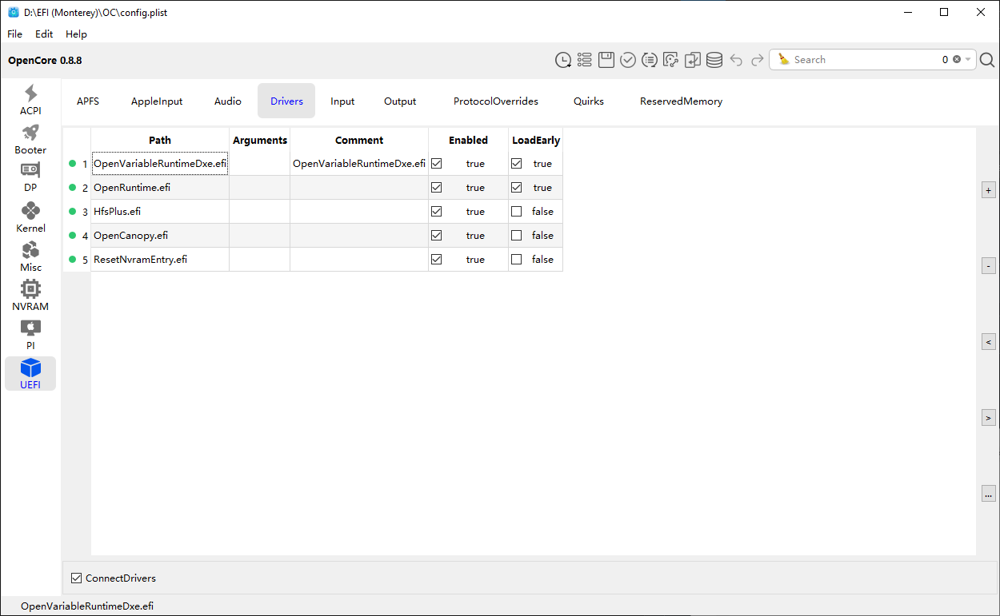
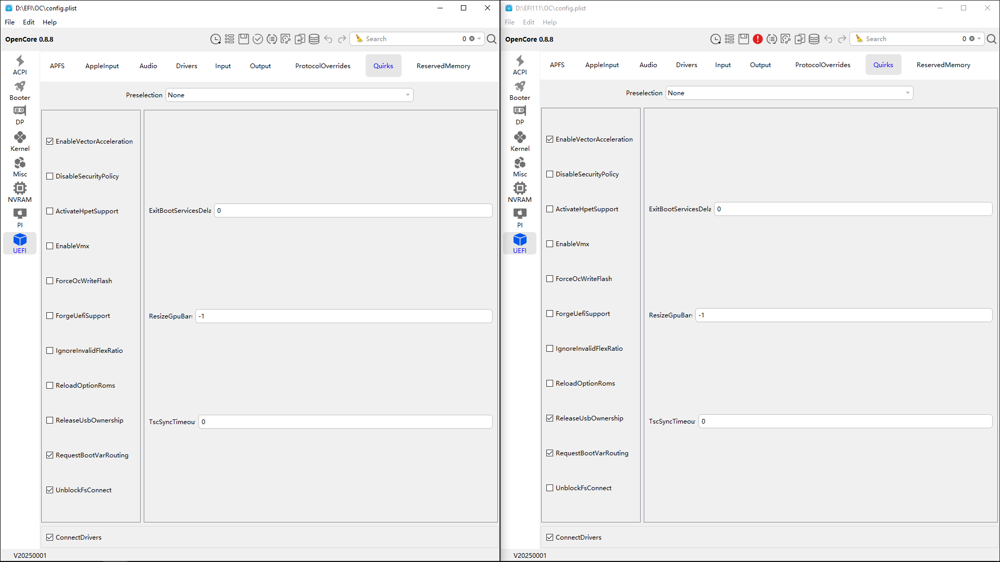
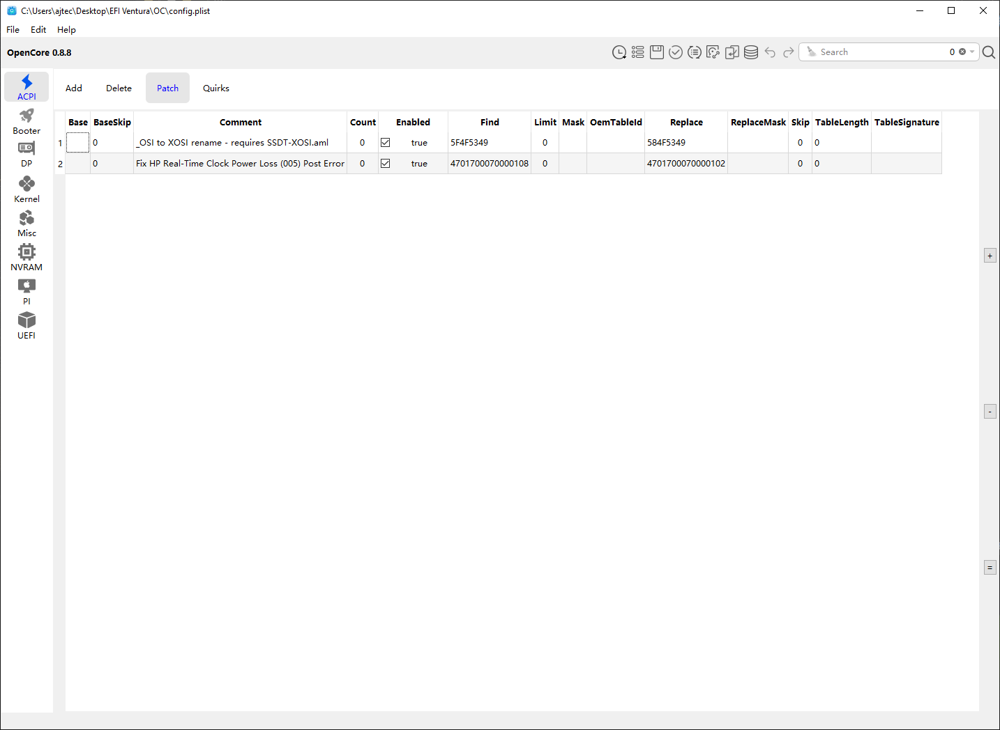

# Hackintosh AMD EDITION EFI – ASUS TUF A17 (FA706IH)

OpenCore EFI for running macOS on **ASUS TUF A17**  
Tested on **AMD Ryzen 5 4600H** with **Radeon iGPU (NootedRed)**.

> ⚠️ This EFI is hardware-specific. Use it as a **reference**, not blindly.

---

# Snapshot







---

## > macOS Compatibility

| macOS Version | Version | Status |
|-------------|-------|--------|
| Monterey | (12.x) | ✅ Stable |
| Ventura | (13.x) | ✅ Stable |
| Sonoma | (14.x) | ✅ Stable |
| Sequioa | (15.x) | 🟡 On-going |
| Tahoe | (26.x) | 🟡 On-going |

---

## > Hardware Specs

| Component | Details |
|---------|--------|
| Model | ASUS TUF A15 |
| CPU | AMD Ryzen 5 4600H |
| iGPU | AMD Radeon (NootedRed) |
| dGPU | GTX 1650 ❌ (Disabled) |
| RAM | 16GB DDR4 |
| Storage | NVMe SSD |
| Audio | Realtek ALC256 (AppleALC) |
| Ethernet | Realtek RTL8111 |
| Wi-Fi / BT | Realtek 8822CE ❌ |
| SMBIOS | MacBookPro16,3 |

---

## > What Works

- ✔ macOS boot & install
- ✔ Hardware acceleration (AMD iGPU)
- ✔ Audio (AppleALC)
- ✔ Ethernet
- ✔ USB ports
- ✔ Sleep / Wake
- ✔ Brightness control
- ✔ iServices (with proper SMBIOS)

---

## > What Doesn’t Work

- ❌ NVIDIA GTX 1650 (till now, doesn't support)
- ❌ Sidecar / Universal Control
- ❌ WiFi/Bluetooth (Realtek has no macOS support)

---

## > ACPI Patches & SSDTs

Included SSDTs:

- `SSDT-EC` – Embedded Controller
- `SSDT-PLUG-ALT` – CPU power management (AMD)
- `SSDT-PNLF` – Backlight control
- `SSDT-USBX` – USB power properties
- `SSDT-USB-Reset` – USB stability
- `SSDT-XOSI` – OSI handling
- `SSDT-ALSO` – Audio support
- `SSDT-Disable_GPU_GPP0` – Disable NVIDIA dGPU
- `SSDT-Disable_Network_GPP4` – Disable unused PCI device

---

## > Graphics Notes (NootedRed)

- Uses **NootedRed** for AMD iGPU acceleration
- If internal display is black:
  - Try newer NootedRed build
  - Increase VRAM via **Smokeless UMAF**
  - Use `-NRedDPDelay` boot-arg

---

## > Booting macOS Installer on AMD (Literally a thorny path)

Booting the macOS installer on **AMD laptops** is the hardest ost time-consuming part of the Hackintosh process.(For me, atleast)
It took me **~7 days of trial, errors, reboot hell, pure brainstorm chaos and debugging** to finally reach a successful installer boot.

This section documents **exactly what worked**, **what broke things**, and **why these settings matter**.

### ⚠️ The Core Problem on AMD
- AMD firmware handles **memory mapping and NVRAM very differently** from Intel
- Settings that boot **Recovery** may still **break the installer**
- Most installer failures happen due to:
  - Incorrect Booter quirks
  - Broken NVRAM routing
  - Wrong UEFI driver order

### 1️⃣ Booter → Quirks

### ✅ Final Working Configuration
Enabled:
- `DevirtualiseMmio`
- `EnableSafeModeSlide`
- `ProvideCustomSlide`
- `SetupVirtualMap`
- `RebuildAppleMemoryMap`
- `SyncRuntimePermissions`



### 2️⃣ NVRAM → boot-args

Final working boot arguments:
```
-v debug=0x100 keepsyms=1 -vi2c-force-polling -wegnoegpu
```



NOTE: if macOS installer got stuck while installation part, enable few checkboxs:
- `LegacyEnable` - YES
- `LegacyOverwrite` - YES
- `WriteFlash` - YES

### 3️⃣ UEFI → Drivers

Correct driver order is mandatory.

1. `OpenVariableRuntimeDxe.efi` → **LoadEarly = true**
2. `OpenRuntime.efi` → **LoadEarly = true**
3. `HfsPlus.efi`
4. `OpenCanopy.efi`
5. `ResetNvramEntry.efi`



### 4️⃣ UEFI → Quirks

Enabled:
- `EnableVectorAcceleration`
- `RequestBootVarRouting`
- `UnblockFsConnect`



### - Final Outcome
After aligning **kernel patches, Booter quirks, NVRAM routing, and UEFI Setup**,  
the macOS installer booted reliably and completed installation successfully.

This EFI reflects the **final, stable configuration** after all that testing on Ryzen 5 4600H.

### 💡 Bonus
Fix Real-Time Clock on macOS (add 2nd line as it is)



---

## > EFI Structure

```bash
EFI
├── BOOT
└── OC
    ├── ACPI
    ├── Drivers
    ├── Kexts
    ├── Resources
    └── Tools
```

---

## 🙌 Credits

- **Acidanthera** – [OpenCorePkg](https://github.com/acidanthera/OpenCorePkg), [Lilu](https://github.com/acidanthera/Lilu), [AppleALC](https://github.com/acidanthera/AppleALC)
- **Dortania** – Documentation, [USBToolbox](https://github.com/USBToolBox/kext), [USB Mapping](https://github.com/USBToolBox/tool)
- **corpnewt** - [GenSMBIOS](https://github.com/corpnewt/GenSMBIOS)
- **ChefKissInc** – [AMD iGPU patches](https://github.com/ChefKissInc/NootedRed)
- **jwise** - [USB tethering](https://github.com/jwise/HoRNDIS), [ForgedInvariant](https://github.com/ChefKissInc/ForgedInvariant)
- **ic005k** - [OCAuxiliary tool](https://github.com/ic005k/OCAuxiliaryTools)
- Hackintosh community 🖤

---

## ⚠️ Disclaimer

This project is provided **as-is**.  
I am **not responsible** for data loss, hardware damage, or failed installs.
Proceed only if you know what you’re doing. 
